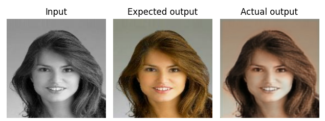
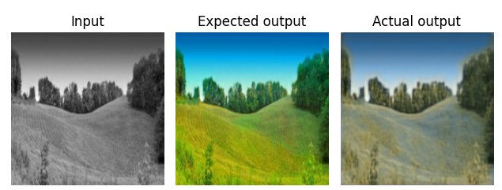
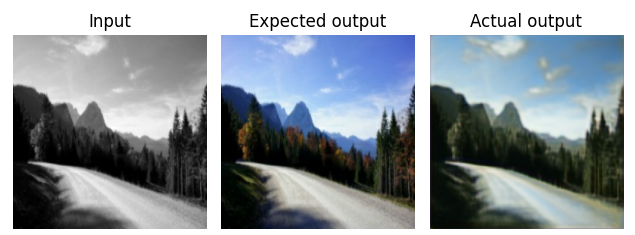
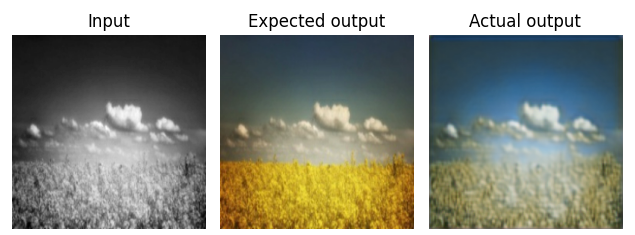

<!-- MARKDOWN LINKS & IMAGES -->

[status-icon]: https://img.shields.io/badge/status-active-success.svg
[project-url]: https://github.com/DamianTab/autoencoder
[issues-icon]: https://img.shields.io/github/issues/DamianTab/autoencoder.svg
[issues-url]: https://github.com/DamianTab/autoencoder/issues
[pulls-icon]: https://img.shields.io/github/issues-pr/kylelobo/The-Documentation-Compendium.svg
[pulls-url]: https://github.com/DamianTab/autoencoder/pulls
[license-icon]: https://shields.io/badge/license-Apache%202-blue.svg
[license-url]: /LICENSE
[author-url]: https://github.com/DamianTab

<p align="center">
  <a href="" rel="noopener">
 </a>
</p>


<h3 align="center">Autoencoder</h3>

<div align="center">
  
  [![Status][status-icon]][project-url]
  [![GitHub Issues][issues-icon]][issues-url]
  [![GitHub Pull Requests][pulls-icon]][pulls-url]
  [![License][license-icon]][license-url]
</div>

---

<p align="center"> Deep Neural Network Project - Autoencoder
    <br> 
</p>

## 📝 Table of Contents
- [About](#about)
- [Technologies](#technologies)
- [Getting Started](#getting_started)
- [Usage](#usage)
- [Deployment](#deployment)
- [Authors](#authors)
- [Acknowledgments](#acknowledgement)

<br/>

## 🧐 About <a name = "about"></a>
This small project presents autoencoder entity with trained deep neural network. It allows to use pre-trained network to color small grey-scaled pictures.

More info in report (Polish language):
[report](report.pdf)

Examples:







<br/>

## ⛏️ Technologies <a name = "technologies"></a>
- Python3
- Tensorflow

<br/>
  
## 🏁 Getting Started <a name = "getting_started"></a>
These instructions will help you set up and run project on your local machine for development and testing purposes. See [deployment](#deployment) for notes on how to deploy the project on a live system.

Code is included in packages: `ai` and `experiments`.

<br/>

To train network and see predictions run:

```
python3 experiments/autoencoder_same_size2.py
```

To only predict result (see photos above):

```
python3 experiments/autoencoder_same_size_predict_only.py 
```


<br/>

## 🎈 Usage <a name="usage"></a>
First train the deep neural network then wait for results. 

Each result of epoch is saved and then overwrite in next one. Best solution and last epoch solution is stored in `saved_models` directory.


<br/>

## 🚀 Deployment <a name = "deployment"></a>
No deployment available.

<br/>


<br/>

## ✍️ Authors <a name = "authors"></a>
- [@DamianTab][author-url]
- [@PiotrJTomaszewski](https://github.com/PiotrJTomaszewski)

<br/>

## 🎉 Acknowledgements <a name = "acknowledgement"></a>

We want to thank authors of dataset that we used:
https://github.com/ml5js/ml5-data-and-models/tree/main/datasets/images/landscapes
